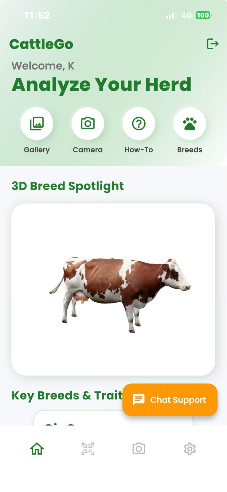
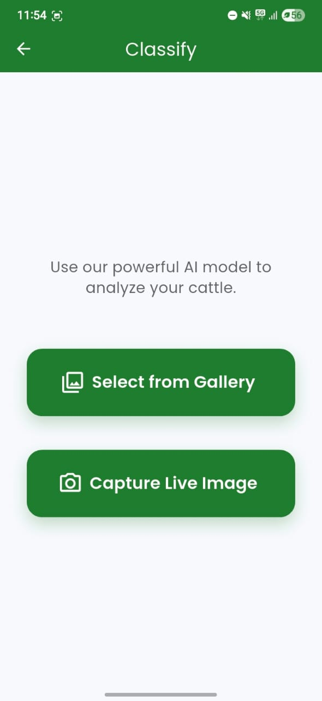
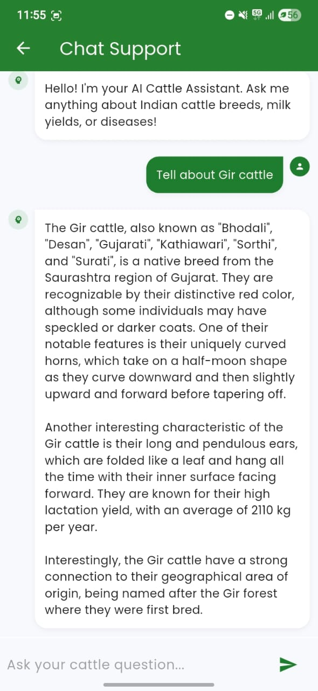

# 🐄 CattleGo — Intelligent Livestock Identification Platform

> AI-powered Indian cattle breed identification for farmers, researchers, and livestock professionals — built with Flutter, MobileNetV2, and a fully local RAG chatbot.

[](https://flutter.dev)
[](https://tensorflow.org)
[](https://python.org)
[](https://firebase.google.com)
[](https://langchain.com)
[](LICENSE)

---

## What is CattleGo?

CattleGo is an end-to-end agri-tech platform that enables instant identification of **40+ Indian cattle breeds** from a phone camera — no veterinary expertise required. It combines a fine-tuned deep learning model, a retrieval-augmented generation (RAG) chatbot, and a multilingual Flutter app to make livestock management accessible to farmers across India.

The platform addresses a real gap: breed identification in India is manual, expertise-dependent, and inaccessible at scale. CattleGo automates it.

---

## Demo

<table>
  <tr>
    <td align="center" width="33%">
      
      <br/><sub><b>Home</b></sub>
    </td>
    <td align="center" width="33%">
      
      <br/><sub><b>Breed Classification</b></sub>
    </td>
    <td align="center" width="33%">
      
      <br/><sub><b>RAG Chatbot</b></sub>
    </td>
  </tr>
</table>

> 📹 **[Watch Demo Video](https://drive.google.com/file/d/1-cXiEN8BT-1vdZJgJdPXBB815iFAY_SA/view?usp=drive_link)** 

> 📲 **[Download Android APK](https://github.com/SanjaySiva-2437/CattleGo/releases/download/CattleGo-v1.0.0/CattleGo-APK.Release.--.apk)** — Enable *"Install from unknown sources"* before installing.

---

## System Architecture

```
┌─────────────────────────────────────────────────┐
│              CattleGo Mobile App                │
│                  (Flutter)                      │
│                                                 │
│  Firebase Auth ──► User Login / Registration    │
│                                                 │
│  Camera / Upload ──► FastAPI Backend            │
│                         │                       │
│                         ▼                       │
│                  MobileNetV2 Model              │
│               (Breed Classification)            │
│                                                 │
│  Chat Input ──► RAG Chatbot Server              │
│                    │                            │
│                    ▼                            │
│          LangChain + Chroma + Ollama            │
│         (Grounded breed Q&A responses)          │
└─────────────────────────────────────────────────┘
```

---

## Repository Structure

| Module | Description | Docs |
|--------|-------------|------|
| [`mobile-app/`](mobile-app) | Flutter app — UI, Firebase auth, camera integration, multilingual support | [README →](mobile-app/README.md) |
| [`ml-model/`](ml-model) | MobileNetV2 training pipeline, 4-stage fine-tuning, evaluation | [README →](ml-model/README.md) |
| [`rag-chatbot/`](rag-chatbot) | Fully local RAG system — LangChain, Chroma, Ollama, FastAPI | [README →](rag-chatbot/README.md) |

---

## Tech Stack

| Layer | Technology |
|-------|------------|
| Mobile App | Flutter 3.x (Dart) |
| Authentication | Firebase Auth |
| Database | Firebase Firestore |
| ML Model | TensorFlow / Keras — MobileNetV2 |
| Model Serving | FastAPI + ngrok |
| RAG Framework | LangChain + Chroma + Ollama (`gemma3:12b`) |
| Embeddings | `nomic-embed-text` via Ollama |
| Localization | Flutter i18n — English, Tamil, Hindi |
| Training Hardware | NVIDIA RTX 4070 (12GB VRAM) |

---

## Quickstart

Each module has its own detailed setup guide. Start here:

```bash
git clone https://github.com/SanjaySiva-2437/CattleGo.git
cd CattleGo
```

Then follow the setup guide for each module:

1. **ML Model** → [`ml-model/README.md`](ml-model/README.md)
2. **RAG Chatbot** → [`rag-chatbot/README.md`](rag-chatbot/README.md)
3. **Mobile App** → [`mobile-app/README.md`](mobile-app/README.md)

---

## Roadmap

- [ ] On-device inference via TensorFlow Lite (offline support)
- [ ] Improve classification accuracy beyond 80% with expanded dataset
- [ ] GPS-based livestock tracking
- [ ] Real-time health monitoring
- [ ] Breed recommendation engine by climate and region
- [ ] Expand language support — Telugu, Kannada, Marathi
- [ ] Veterinary disease diagnosis via RAG knowledge base expansion

---

## Team

Built by **Team VeriSimilar** — © 2025

| Name | GitHub |
|------|--------|
| S. Sanjay Siva | [@SanjaySiva-2437](https://github.com/SanjaySiva-2437) |
| Sanchai KB | — | [@KBSanchai](https://github.com/KBSanchai) |
| Sanjay Kumar | — | [@Sanjay1717KSK](https://github.com/Sanjay1712KSK) |
| Sarvesh Sathyanarayanan | — | [@chintu1010](https://github.com/chintu101) |

> Add your teammates' GitHub handles and update the links above.

---

## Contributing

We welcome contributions across all modules — model accuracy improvements, new language support, UI enhancements, and documentation. Please open an issue before submitting a pull request.

---

## License

[MIT](LICENSE) — All Rights Reserved, Team VeriSimilar 2025